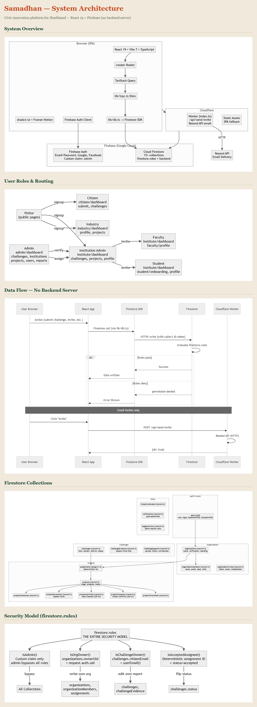

<div align="center">


# समाधान · Samadhan

**A civic problem-solving platform that turns citizen reports into funded, delivered projects — with no server, no gatekeepers, and a tamper-evident paper trail.**

[](https://react.dev)
[](https://www.typescriptlang.org)
[](https://vitejs.dev)
[](https://firebase.google.com)
[](https://tailwindcss.com)
[](https://workers.cloudflare.com)

<sub>No backend. No API. Just the browser, Firebase, and a security-rules file doing all the work.</sub>

</div>

---

## 🧭 What is this?

**Samadhan** ("solution") pipes local civic problems — broken handpumps, unlit roads, unsafe crossings, digital-access gaps — through one clean workflow, end to end:

```
📣 Citizen reports  →  🎯 Institution picks it up  →  🏗️ Project gets delivered  →  ✅ Citizen re-verifies  →  🔒 Sealed in a hash chain
```

Four account roles, one pipeline — and institutions aren't a single login underneath:

| Role | What they do |
|---|---|
| 🧑‍🤝‍🧑 **Citizens** | Report challenges with photo, location & description — in English, Hindi, or Santali, by voice, by handwriting scan, or offline |
| 🏫 **Institutions** | Get verified, then self-enroll or get assigned challenges and turn them into delivery projects with milestones, documents & a team |
| ┗ 🎓 &nbsp;*Faculty* | Mentor assigned projects, oversee their students, post in the project forum — no enroll/create-project/org-admin controls |
| ┗ 📚 &nbsp;*Students* | Work their own projects, track team activity, post in the project forum — read-only on everything else |
| 🏭 **Industry partners** | Back institution-led projects with funding, expertise, or CSR support |
| 🛡️ **Admins** | Verify organizations, moderate standing, watch a live GIS command center — and otherwise get out of the way |

The single most important design decision in this codebase: **there is no backend.** The browser talks straight to Cloud Firestore, and `firestore.rules` is the *entire* security model. If it's not enforced there, it isn't enforced anywhere.

---

## ✨ Feature highlights

<table>
<tr>
<td width="50%" valign="top">

### 🗣️ Bhasha & Bol
Fill the whole report form by **speaking** (Hindi/English, on-device Web Speech API) or by **scanning handwritten notes** (Tesseract OCR, `hin+eng`). Nothing is ever auto-submitted — every field stays editable before you hit send.

### 🌐 Trilingual, live
English, हिंदी (Tiro Devanagari), and ᱥᱟᱱᱛᱟᱲᱤ (Ol Chiki) — a blocking first-visit language gate, a persistent switcher, and a **live DOM-level auto-translator** that covers every page without a single hardcoded string.

### 📡 Offline-first PWA
File a report with zero signal. Drafts queue in IndexedDB and auto-submit the moment you're back online — built for low-connectivity districts.

### 🤖 AI auto-categorize + duplicate shield
Drop a photo, get title/description/domain filled by a vision model. A parallel word-overlap check flags likely duplicate reports in the same district before you submit.

</td>
<td width="50%" valign="top">

### 🔗 Hash-anchored ledger
Every project activity and closeout is chained with `SHA-256` (`prevHash → hash`), verifiable client-side with one look — `Verified ✓ (N links)` or `Tampered at #K ✗`. Admins can anchor a Merkle root for public proof.

### 🗺️ GIS command center
A live Jharkhand district choropleth, bottleneck alerts (aging unresolved reports), and trend charts — all computed client-side from the same data everyone else can already read.

### 🎯 Intelligent routing
A pure client-side match engine scores verified institutions against each challenge on domain expertise, geographic proximity, and current workload — surfaced as "fit" badges for institutions and ranked suggestions for admins.

### ✅ Citizen-decided closeout
No admin approval gate. The institution submits before/after evidence; **the citizen who filed the report** confirms it's fixed or disputes it — full stop. Confetti included.

</td>
</tr>
</table>

<table>
<tr>
<td width="50%" valign="top">

### 🎓 Student & faculty portal
Institutions aren't a single login. Members get their own **student** or **faculty** sub-role with a dedicated dashboard, onboarding flow, and profile — students see their own projects, progress rings, and a live team-activity feed; faculty get mentor oversight across their assigned projects. A shared **project forum** is where the actual discussion happens, scoped per project.

### 🧾 Academic credits & certificates
On project closeout, the team is awarded credits (`min(100, teamSize × 10 + milestones × 5)`, split evenly across members) and a verifiable PDF certificate is generated client-side (lazy `jspdf` + `qrcode`) — tied back into the same hash-chain used for closeout verification.

</td>
<td width="50%" valign="top">

### 🧑‍🤝‍🧑 Assisted reporting
Not everyone filing a report has a smartphone. An operator (CSC/Panchayat-style) can submit **on behalf of** a beneficiary — capturing their name, phone, and consent — with a demo OTP issued for beneficiary confirmation, so the actual affected person stays verifiably in the loop.

### 🕵️ Tiered visibility & escalation
Sensitive reports (harassment, safety) can be filed as **restricted** or fully **confidential** — Firestore itself, not just the UI, blocks public reads of confidential reports. Aging unresolved challenges climb a staged escalation ladder (14-day internal notice → 30-day external escalation), visible live on the admin reports dashboard.

</td>
</tr>
</table>

---

## 🏛️ Architecture

```
   Browser (React 19 SPA)
        │
        ├── Firebase Auth  ──── Email/Password · Google · Facebook
        │
        └── Cloud Firestore ─── every collection, direct from the client
                 │
                 └── firestore.rules ← the entire access-control boundary
```

No Express, no tRPC server, no Cloud Functions, no Cloud Storage. Files live as compressed base64 *inside* Firestore documents (Spark/free-tier friendly); roles are resolved from Firebase Auth custom claims, never a client-writable field; and every workflow write is scoped to the exact owner it belongs to — not just "is this user logged in."

<div align="center">

</div>

---

## 🧱 Tech stack

| Layer | Choice |
|---|---|
| **UI** | React 19 · Vite 7 · TypeScript · `wouter` routing · Tailwind CSS v4 · shadcn/ui · Framer Motion |
| **Data** | Cloud Firestore (direct client SDK access) via a `trpc`-shaped shim (`client/src/lib/trpc.ts`) — zero rewrite of the page layer |
| **Auth** | Firebase Authentication (Email/Password, Google, Facebook) · admin = custom claim, never a document field |
| **Offline** | `idb` (IndexedDB) · `vite-plugin-pwa` (Workbox) · Firestore offline persistence |
| **Integrity** | Native `SubtleCrypto` SHA-256 hash chain · `qrcode` for anchor verification |
| **OCR / Voice** | `tesseract.js` (lazy-loaded) · Web Speech API |
| **Maps** | `react-leaflet` + a hand-normalized 24-district Jharkhand GeoJSON |
| **Charts** | `recharts` |
| **Testing** | Vitest — live Firestore rules boundary check, no credentials needed |
| **Hosting** | Cloudflare Workers (static assets), deployed via GitHub Actions + `wrangler` |

---

## 🚀 Getting started

```bash
# install
npm install

# configure — create a .env in the repo root (see Environment below)

# run
npm run dev
```

| Command | What it does |
|---|---|
| `npm run dev` | Start the Vite dev server |
| `npm run build` | Production build → `dist/public` |
| `npm run check` | Type-check the whole project |
| `npm test` | Run the Firestore rules boundary test (no credentials required) |
| `npm run test:rules:emulator` | Full signed-in rules test suite, against the local Firestore emulator |
| `npm run deploy` | Build + deploy static assets to Cloudflare |
| `npm run deploy:rules` | Deploy `firestore.rules` to the live project |
| `npm run grant-admin -- <email>` | Grant (or `--revoke`) the admin custom claim |

### Environment

| Variable | Purpose | Ships to browser? |
|---|---|---|
| `FIREBASE_SERVICE_ACCOUNT_JSON` | Used only by the admin-grant script | ❌ No |
| `VITE_GROQ_API_KEY` | Powers the AI photo auto-categorize feature | ✅ Yes (by design) |

The public Firebase web config lives directly in `client/src/lib/firebase.ts` — that's expected; it's not a secret, and access control is enforced entirely by `firestore.rules`.

---

## 🔒 Security model, in one paragraph

Every read and write goes **browser → Firebase client SDK → Firestore**. There is no server left to trust, so `firestore.rules` does everything a backend normally would: it resolves ownership back to `organizations.ownerUid` / `challenges.citizenEmail` on every write, uses deterministic document IDs so a rule can cheaply prove "this exact institution holds a real accepted assignment for this exact challenge," blocks self-elevation to admin, and validates that every notification's claimed recipient is the real party in that relationship — not just a well-typed string. Covered by an emulator-backed test suite exercising the actual ownership boundaries, not just "is this collection readable."

---

## 🗂️ Project structure

```
client/src/
├── pages/          one file per route — large, single-file, deliberately not over-split
├── components/     shared UI: headers, AccountMenu, LedgerSeal, InteractiveMap, LanguageGate...
├── hooks/          useAuth — wraps Firebase's onAuthStateChanged
├── lib/            db.ts (Firestore data layer), matching.ts, ledger.ts, i18n, bhasha.ts...
└── contexts/       Theme + Language providers

shared/             workflow status enums + route constants
drizzle/            type-only schema — documents collection shapes, no live database
firestore.rules     the security model
docs/               design docs, research notes, USP write-ups
```

---

<div align="center">

Built for districts where the signal drops but the problem doesn't wait.

</div>
